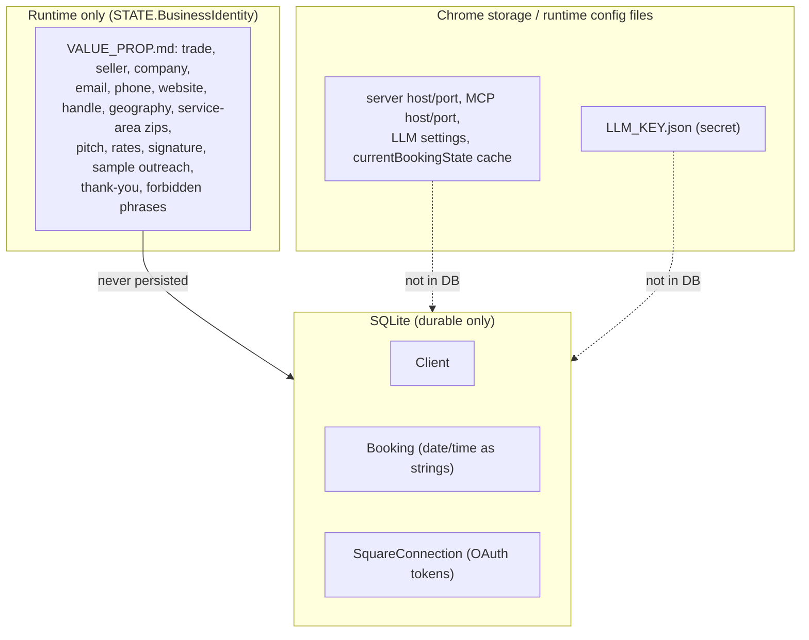
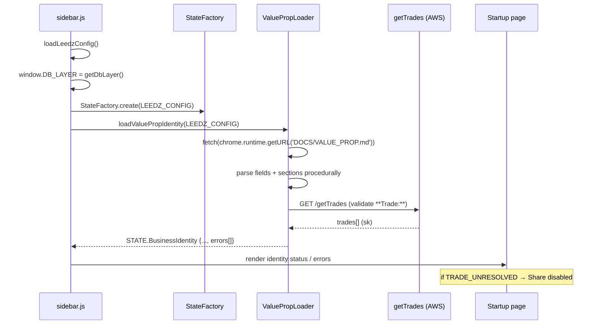
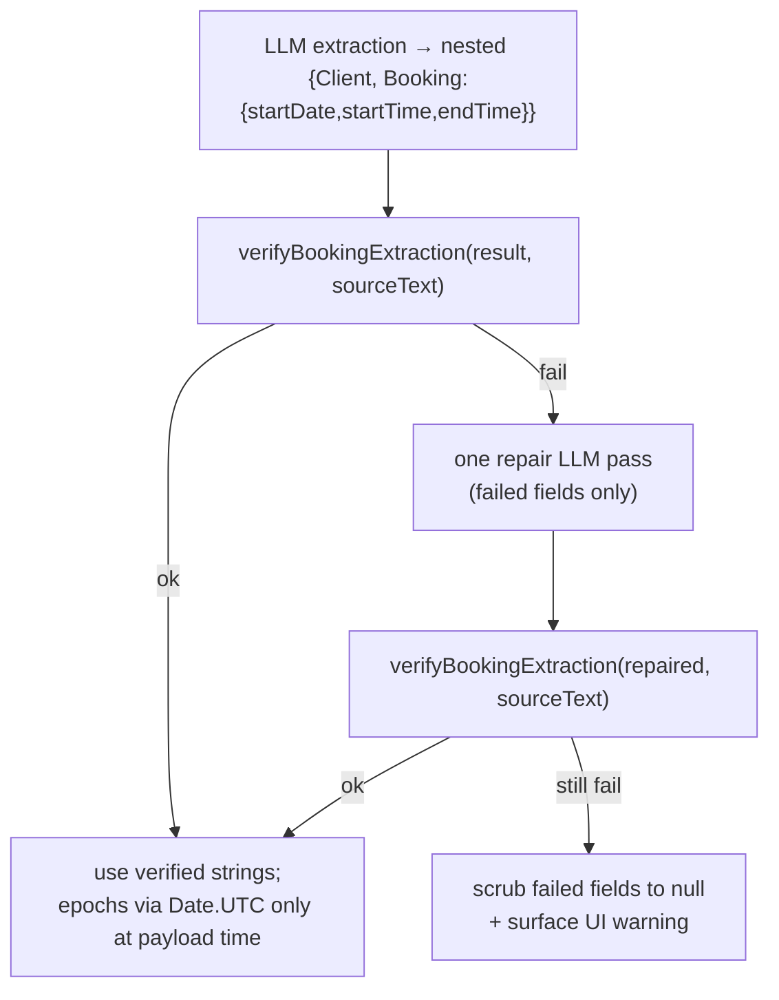

# refactor: INVOICER runtime business identity + DB contract + deterministic dates

## Summary

Refactor the INVOICER Chrome extension and its local Prisma/SQLite server so business
identity comes from `client/DOCS/VALUE_PROP.md` at runtime (never the database), the
database shrinks to durable CRM + Square state behind a safe migration, every parser
shares one seller-identity filter, LLM date/time output is verified against source text
(no silent year-rolling, no fabricated times), booking fetches go through the DB API, the
three write-style pages collapse into one `Write` tab, and the full and ShareEx extensions
build from a single source tree.

This plan was verified against the current codebase on 2026-06-14. It supersedes the
older approach in `client/DOCS/BUGS.md` (which stored identity in `Config` and parsed
VALUE_PROP with the LLM). Where this plan and `BUGS.md` disagree, this plan wins.

## Problem Frame

The extension currently mixes durable database state, local runtime settings, business
identity, prompt content, and parser behavior, which produces two confirmed production bug
classes:

1. **Seller-as-client (Bug A).** Seller identity is missing/stale in DB-backed `Config`,
   so parsers can return the seller as `Client[0]`. Verified root cause: `gmail_parser.js`
   is the only parser that filters the seller (via `ValidationUtils.isUserIdentity`, which
   reads `state.Config.companyEmail`/`companyName`); those are empty because Startup never
   writes them, so the filter always returns false. `gcal_parser.js` and `client_parser.js`
   have no procedural filter at all, and `client_parser.js` overrides `parse()` so any
   base-class filter would be bypassed.
2. **Wrong booking times (Bug B).** The LLM hallucinates or refuses date/time fields
   (e.g. source `12:30 PM` shared as `7 PM`). `PageUtils.validateAndCorrectDates()` —
   the only guard today — is dead code: it early-returns on `!parsedData.startDate`, but
   parsers pass the nested `{Client, Booking:{startDate,...}, Config}` shape, so `startDate`
   lives under `.Booking` and the check never runs. Even if fixed for nesting, it silently
   mutates years, which is itself unsafe.

The structural fix: make `VALUE_PROP.md` the single runtime source of business identity,
keep the database focused on durable CRM (`Client`, `Booking`) plus durable integration
state (`SquareConnection`), and replace LLM-trusted dates with source-evidence verification.

---

## Scope Boundaries

**In scope**

- Runtime `VALUE_PROP.md` identity loading with a blocking trade gate (Phase 1).
- Prisma `Config` removal → `SquareConnection`, narrow server endpoints, and a safe legacy
  DB migration **script** with dry-run (Phase 2).
- One shared identity filter across all parsers (Phase 3).
- Source-evidence date/time verification with a single repair pass (Phase 4).
- Booking fetches through the DB API (Phase 5).
- One `Write` tab replacing Respond/ThankYou/Outreach (Phase 6).
- Single source tree, two build targets; delete the duplicate `shareex` tree (Phase 7).

### Deferred to Follow-Up Work

- **Invoice/PDF settings off `Config`.** `client/js/render/*` and `client/js/settings/*`
  still read business/bank fields from `Config`. This plan keeps a compatibility shim that
  reads those values without writing SQLite; a full PDF/invoice settings redesign is a
  separate effort (see KTD10).
- **Running the destructive migration against the live database.** The script + dry-run are
  in scope; the actual live run is a gated manual operator step (see KTD6).
- **DOCS folder cleanup** (the `client/DOCS/` and parent `DOCS/` pruning enumerated in
  `BUGS.md` §8). Documentation hygiene, not part of this refactor's behavior.
- **`Booker.js` 4PM–12AM save rejection** and the **fresh-page first-parse race** noted in
  `BUGS.md` Appendix B — revisit after Phase 4 lands (the date utilities may help the first).

### Non-Goals

- Collapsing `Booking` date/time strings into epoch-only fields. They stay as editable UI
  strings (see KTD4).
- Caching marketplace friends in SQLite. Friends stay a runtime marketplace fetch.
- Introducing TypeScript anywhere (see KTD7).

---

## Key Technical Decisions

- KTD1. **Runtime-only identity (supersedes `BUGS.md`).** Business identity lives only in
  `STATE.BusinessIdentity`, loaded at sidebar startup from `client/DOCS/VALUE_PROP.md`. It
  is never written to SQLite, Prisma `Config`, `/config`, or the durable
  `currentBookingState`. This reverses `BUGS.md`'s approach (mirror identity into `Config`
  columns + a `businessDescription` JSON blob + a new `defaultTrade` column). Rationale:
  removes the staleness that causes Bug A and removes an entire class of DB-mirroring bugs.
- KTD2. **Procedural markdown parse, not LLM.** `VALUE_PROP.md` is parsed deterministically.
  Rationale: identity must be exact and testable, and this matches the "don't trust the LLM"
  philosophy of the date work. (`BUGS.md` proposed an LLM parse; rejected.)
- KTD3. **Trade validation fetches remote `getTrades`.** No canonical trade list exists in
  the repo; trades are served by the AWS `getTrades` Lambda
  (`leedz_config.json` → `aws.apiGatewayUrl` + `/getTrades`), returning objects keyed by
  `sk`. The loader matches `**Trade:**` against `sk` case-insensitively. A missing/blank trade
  → blocking `TRADE_MISSING`; a *definitive* no-match (list fetched, no `sk` match) → blocking
  `TRADE_UNRESOLVED`. On a *fetch failure*
  (server/offline) → do not hard-block: load identity, set `tradeUnverified`, and let
  the Share page decide. Because the list is remote-only, a *no-match* is undecidable
  offline — when the fetch fails the loader sets `tradeUnverified`, never `TRADE_UNRESOLVED`.
  Decision table: missing/blank → `TRADE_MISSING` (block Share); fetch ok + match → resolved;
  fetch ok + no match → `TRADE_UNRESOLVED` (block Share); fetch fails → `tradeUnverified`
  (do not block). Rationale: a network outage must
  not brick identity loading.
- KTD4. **Delete Prisma `Config`; add `SquareConnection`.** SQLite stores only `Client`,
  `Booking`, `SquareConnection`. `Booking` keeps `startDate`/`endDate`/`startTime`/`endTime`
  as editable strings; no epoch columns are added.
- KTD5. **Migration without a new native dependency.** `better-sqlite3` is *not* installed;
  `@prisma/client` v5 *is*. The migration uses Prisma's `$queryRawUnsafe`/`$executeRawUnsafe`
  (introspect, copy Square fields, `DROP TABLE Config`, `PRAGMA integrity_check`) plus Node
  `fs.copyFileSync` for the backup. Raw SQL works on the legacy `Config` table even though
  the new Prisma schema no longer models it. `BUGS.md`/`PLAN.md` suggested adding
  `better-sqlite3`; rejected per `CLAUDE.md` minimal-dependency rule unless raw SQL proves
  insufficient.
- KTD6. **Live migration is a gated manual step.** The script and `--dry-run` are in scope;
  the destructive run against `server/data/leedz.sqlite` (the configured live DB) and the
  separate `server/dist-pkg/leedz-server-win-x64/data/leedz.sqlite` copy is executed by the
  operator after reviewing dry-run output. Both DB files are independent and must each be
  migrated.
- KTD7. **Plain JS only.** New server/migration code is CommonJS (matching
  `server/src/prisma_sqlite_db.js`); new client code is ESM (matching existing `client/js`).
  The server's TS scaffolding (`tsconfig`, `ts-node`, `src/server.ts`) is not used by the
  runtime (`npm start` runs `src/leedz_server.js`) and is left untouched. No `.ts` files are
  created or read (`CLAUDE.md`).
- KTD8. **Fix the broken Square OAuth callback during the cut-over.** `GET /square/callback`
  currently calls `db.getConfig()` and `db.updateConfig(configData)`, but the DB class
  exposes `getLatestConfig()` and `updateConfig(id, data)` — the persistence path is broken.
  Re-point it at `SquareConnection` write methods as part of Phase 2.
- KTD9. **Sequence core fixes before large refactors.** Phases 1–5 (identity, DB contract,
  filter, dates, booking API) land before Phase 6 (Write tab) and Phase 7 (dual build).
- KTD10. **Invoice/PDF settings stay on a read-only shim.** `render/*` and `settings/*`
  keep reading the business fields they need without writing SQLite; the full migration off
  `Config` is deferred. The one in-scope exception: `settings/PDF_settings.js` currently calls
  `STATE.save()` (which posts the deleted `/config`), so Phase 2 must *neutralize* those write
  calls (redirect to `chrome.storage.local`/a runtime settings file) to make the shim genuinely
  read-only. Neutralizing a broken write path is not the deferred redesign — the full PDF
  settings rework stays deferred.
- KTD11. **Port the date verifier from `agent_shareLeed`.** Mirror the external Python
  reference (`share_helpers.py`, verified present) — its epoch function is
  `leedz_wallclock_epoch` (ported to JS `wallClockEpochUtc` using `Date.UTC`). Port a subset
  of its 42-test suite.
- KTD12. **Identity crosses the sidebar→content boundary by value; it cannot be a global.**
  Parsers run in the content-script realm, which does not share memory with the sidebar —
  `content.js` rebuilds a throwaway state via `StateFactory.create_blank()` +
  `fromObject(msg.state)`. Therefore `STATE.BusinessIdentity` MUST be added to
  `State.toObject()`/`fromObject()` and passed by every `toObject()` send site
  (`Page.js`, `ClientCapture.js`, `Outreach.js`), and the serialization change must land
  **first in Phase 1, before the Phase 2 Config shrink and the Phase 3 filter** — otherwise
  the seller-as-client bug gets worse mid-refactor (the filter loses `Config.companyEmail`
  before `BusinessIdentity` is available to parsers). Pages (sidebar realm) may read
  `STATE.BusinessIdentity` directly; parsers (content realm) receive it only via the
  serialized `state` payload and must accept it as input to `initialize(state)` — never
  reach for a sidebar global.
- KTD13. **Live DBs are migrated only by the hand-written script — never `prisma migrate
  deploy`.** The generated Prisma migration (U4) drops `Config` with no Square-field copy
  (the precedent migration `server/prisma/migrations/20260101061519_remove_sq_constants/`
  uses the RedefineTables DROP pattern), so running it against a live DB destroys OAuth
  tokens. The Prisma migration is for fresh/dev DBs only; the live `server/data/leedz.sqlite`
  and the packaged `dist-pkg` copy go through `migrate_trim_config.js`, which copies Square
  fields *before* dropping `Config`. The script must reconcile `_prisma_migrations` so a
  later `prisma migrate status` is clean.
- KTD14. **`SquareConnection` is a singleton.** No natural unique key exists on the model, so
  the migration and the server write methods enforce a single row via a fixed sentinel `id`
  (e.g. `"default"`); `getSquareConnection()` reads that one row. The migration asserts
  0-or-1 rows after running. This prevents the fixed OAuth callback (KTD8) and a re-run of
  the migration from producing duplicate, ambiguous connections.
- KTD15. **Localhost auth/CORS and response shaping are a security decision made before the
  new endpoints are written.** The server binds `127.0.0.1:3000` with open `cors()` and no
  auth on most routes, so any web page the user visits can drive it. The new `/square/*`
  endpoints and `/health`/`/meta` must (a) restrict CORS to the extension origin and/or
  require the existing `leedzJWT` on state-changing routes, (b) never return raw
  `accessToken`/`refreshToken` (status returns only `{connected, merchantId, expiresAt}`),
  and (c) never leak absolute filesystem paths or secrets. The rewritten OAuth callback
  validates a real random `state` nonce (not the literal `'authorized'`).
- KTD16. **Secrets and token-bearing DB files must leave the repo.** `server/server_config.json`
  contains committed **production** Square credentials and `.sqlite`/backup files contain live
  OAuth tokens; `.gitignore` does not currently cover them. This refactor rotates the Square
  `appSecret`, moves secrets to an untracked file (with a committed `*.example.json`),
  gitignores `*.sqlite`/`*.sqlite-journal`/`*-wal`/`*.backup-*` and the data dirs,
  `git rm --cached`es already-committed token-bearing files, and writes migration backups
  **outside** the repo working tree.

---

## High-Level Technical Design

### Data classification — where each kind of data lives after the refactor



### Sidebar startup with runtime identity load



### Date/time verify → repair pipeline (replaces validateAndCorrectDates)



---

## Output Structure

New files this plan introduces (repo-relative; test files live under `client/test/` so
`build.bat` does not copy them into `dist/`):

```text
client/
  js/
    utils/
      ValuePropLoader.js      # U1  procedural VALUE_PROP parse + trade validation
      IdentityFilter.js       # U8  shared seller-identity filter
      DateEvidence.js         # U10 ported date/time verifier
    pages/
      Write.js                # U13 consolidated Write tab
  test/
    ValuePropLoader.test.js   # U1
    IdentityFilter.test.js    # U8
    DateEvidence.test.js      # U10
server/
  scripts/
    migrate_trim_config.js    # U6  one-time legacy DB trim (Config → SquareConnection)
```

---

## Requirements

### Runtime business identity

- R1. Business identity (trade, seller name, company, email, phone, website, handle,
  geography, service-area zips, pitch, rates, signature, sample outreach, thank-you
  template, forbidden phrases) is loaded at sidebar startup from `client/DOCS/VALUE_PROP.md`
  into `STATE.BusinessIdentity`.
- R2. Business identity is never written to SQLite, Prisma `Config`, `/config`, or the
  durable `currentBookingState`. An optional same-session cache is allowed only under a
  distinct key (e.g. `runtimeBusinessIdentity`).
- R3. `VALUE_PROP.md` is parsed procedurally (deterministic markdown parsing), not by the LLM.
- R4. A missing or blank `**Trade:**` yields a blocking `TRADE_MISSING` error, and a
  definitively-unmatched trade (list fetched, no match) yields a blocking `TRADE_UNRESOLVED`
  error; in both blocking cases the Share workflow is disabled while the error exists. A
  `getTrades` fetch failure instead sets `tradeUnverified` without blocking identity load.
- R5. The Startup page shows the identity load result (seller, email, phone, trade) and any
  errors.

### Database contract & migration

- R6. SQLite stores only `Client`, `Booking`, and `SquareConnection`.
- R7. The Prisma `Config` model and all business/runtime/LLM/secret fields are removed from
  both `server/prisma/schema.prisma` and the packaged
  `server/dist-pkg/leedz-server-win-x64/prisma/schema.prisma`.
- R8. Durable Square OAuth state (access, refresh, expiry, merchant, location, state) is
  preserved in `SquareConnection`.
- R9. The legacy-DB migration preserves all `Client` and `Booking` rows, copies Square
  fields from legacy `Config` into `SquareConnection`, then drops `Config`, with a mandatory
  pre-run backup and a passing `PRAGMA integrity_check`.
- R10. The migration supports `--db <path>`, `--dry-run`, and `--keep-config`; refuses to run
  unless it can write a timestamped backup; exits non-zero on any failure.
- R11. The server replaces broad `/config` with narrow endpoints: `/health` (or `/meta`) for
  database name/status, plus `/square/status`, `POST /square/connection`, and
  `DELETE /square/connection`; the Square OAuth callback persists to `SquareConnection`
  (fixing the current broken `db.getConfig()`/`updateConfig(configData)` calls).
- R12. The client stops posting `Config` to `/config`; Startup connection/MCP/LLM settings
  live in `chrome.storage.local`/runtime config files; the `Config.companyName` guard in
  `state.loadConfigFromDB()` is removed.

### Parser identity filtering

- R13. A shared `IdentityFilter` excludes the seller's own identity (email, phone, name) from
  extracted client candidates, sourced from `STATE.BusinessIdentity`.
- R14. The filter is applied in `EventParser`, `ProfileParser`, and explicitly in
  `ClientParser` (which overrides `parse()`); Gmail-only filtering is removed.
- R15. Hardcoded seller identity is removed from `leedz_config.json` parser prompts and
  replaced with a runtime identity block built from `STATE.BusinessIdentity`. Both seller
  emails currently in play (`drawingshowscott@gmail.com` and `scottgrossworks@gmail.com`)
  and the seller phone (`3109801421`) are excluded.
- R16. Across Gmail, GCal, and generic page parses, the seller is never returned as
  `Client[0]`.

### Date/time verification

- R17. LLM-extracted date/time fields are verified against literal source text before any
  conversion or save; unverifiable fields are scrubbed to `null`.
- R18. Exactly one repair LLM pass runs on failed fields only, followed by re-verification;
  surviving failures stay `null` with a surfaced warning.
- R19. Date verification accepts a date only if its evidence appears in source (ISO, numeric,
  or month-name form); a year differing from the base year must literally appear in source
  (no silent year-rolling).
- R20. Time verification accepts a time only with equivalent source evidence (`7pm`,
  `7 p.m.`, `7:00 PM`, `19:00`, `noon`, `midnight`); times without AM/PM context are not
  guessed.
- R21. Epoch values are produced only procedurally (`Date.UTC(...)`) at payload-creation time;
  user-visible date/time strings are never replaced by epochs and no epoch columns are added
  to Prisma.
- R22. `PageUtils.validateAndCorrectDates()` is removed and no longer called; the new verifier
  understands the nested `{Client, Booking:{...}}` shape.

### Booking data API

- R23. `DB_Layer` exposes `getBookings(filters)` and `getBookingsForClient(clientId, options)`.
- R24. All direct `/bookings?clientId=...` fetches — in `Page.reloadParser` (STEP 3.5) and
  `DataPage.searchDB()` — are routed through the DB API.
- R25. The booking API supports the server's query params: `clientId`, `clientEmail`,
  `clientName`, `status`, `startDateFrom`/`startDateTo`.

### Write consolidation

- R26. One `Write.js` page replaces Respond, Thank You, and Outreach, using
  `STATE.BusinessIdentity` for pitch/signature/rates/thank-you and the DB API for past
  bookings.
- R27. `Write` supports reply and compose Gmail modes via the existing content-script compose
  behavior.
- R28. `Responder.js`, `Thankyou.js`, `Outreach.js` and their `leedz_config.json`/`sidebar.html`
  entries are removed only after `Write` is verified.

### Build

- R29. `client/build.bat` copies `DOCS/VALUE_PROP.md` into `dist/DOCS/VALUE_PROP.md`, and
  `manifest.json` `web_accessible_resources` includes `DOCS/VALUE_PROP.md` (or `DOCS/*`).
- R30. `build.bat full` and `build.bat shareex` build from one source tree; the duplicate
  `shareex/leedz-share-ext` tree is removed after output parity is confirmed.
- R31. A shared-file edit propagates to both build targets.
- R32. The `shareex` build target also copies `DOCS/VALUE_PROP.md` into its output and includes
  `DOCS/VALUE_PROP.md` (or `DOCS/*`) in the ShareEx `manifest.json` `web_accessible_resources` —
  the ShareEx Share flow blocks on the trade gate, so it is not exempt from the runtime-identity
  contract.

---

## Implementation Units

Units are grouped by phase. U-IDs are stable; phases map to the source plan's phases.
External reference paths (the Python `agent_shareLeed` module) are in a sibling project, not
this repo, and are cited as absolute paths because they are not repo-relative.

### Phase 1 — Runtime VALUE_PROP loader

#### U1. ValuePropLoader: procedural parse + trade validation

- **Goal:** Create a deterministic loader that reads `DOCS/VALUE_PROP.md`, parses required
  fields and literal sections, validates the trade, and returns a structured
  `BusinessIdentity` object plus an `errors[]` array.
- **Requirements:** R1, R3, R4.
- **Dependencies:** none.
- **Files:**
  - `client/js/utils/ValuePropLoader.js` (new)
  - `client/test/ValuePropLoader.test.js` (new)
- **Approach:** Export `loadValuePropIdentity(leedzConfig)`. Fetch via
  `fetch(chrome.runtime.getURL('DOCS/VALUE_PROP.md'))`. Parse the `## THE PRODUCT` bold
  fields (`**Trade:**`, `**Product Name:**`, `**Seller:**`, `**Email:**`, `**Phone:**`,
  `**Website:**`, `**Socials:**`, `**Geography:**`, `**Rate:**`) and the literal sections
  (`## THE PITCH`, `## SERVICE AREA DETAILS`, `## OUTREACH`/`### Signature`,
  `## OUTREACH`/`### Sample Email`, `## Thank-You`, optional `## FORBIDDEN PHRASES`).
  Required fields: Trade, Product Name, Seller, Email, Phone. Normalize phone to digits
  (`310 980 1421` → `3109801421`). Build `excludedEmails` from the parsed `**Email:**` plus any
  addresses on an optional `**AltEmails:**` line in `VALUE_PROP.md` (comma-separated) — keeping
  the exclusion list in the authoritative identity file so a different seller just omits it.
  Seed the current `VALUE_PROP.md` with the legacy `scottgrossworks@gmail.com` under
  `**AltEmails:**`; if that field is not added, hardcoding it in the loader is a documented
  one-time migration shim (`// TODO: remove once AltEmails is in VALUE_PROP`), not a permanent
  value — a hardcode otherwise contradicts KTD1's single-source rule. Build `excludedPhones`
  from the parsed phone. (The `excludedEmails` example in `client/DOCS/PLAN.md`'s "Exact Runtime
  Data Shapes" shows one address; it should list both.) Validate `**Trade:**` against the AWS
  `getTrades` endpoint
  (`${leedzConfig.aws.apiGatewayUrl}/getTrades`, case-insensitive match on `sk`). Emit the
  exact error string `TRADE_UNRESOLVED: VALUE_PROP **Trade:** value "<value>" is not in the
  canonical marketplace trade list.` on definitive no-match; on missing/blank trade emit a
  `TRADE_MISSING` error; on fetch failure set `trade` but flag `tradeUnverified` (no block).
  Return the object shape documented in `client/DOCS/PLAN.md` ("Exact Runtime Data Shapes").
- **Patterns to follow:** Mirror the `getTrades` fetch usage already in
  `client/js/pages/Share.js` (`loadTradesAsync()`); reuse phone/email normalization
  conventions from `client/js/utils/ValidationUtils.js`.
- **Execution note:** Write the parser tests first; the field/section grammar is exact and
  regression-prone.
- **Test scenarios** (`client/test/ValuePropLoader.test.js`, vitest):
  - Happy path: the current `client/DOCS/VALUE_PROP.md` parses to `trade:'caricatures'`,
    `sellerName:'Scott Gross'`, `companyEmail:'drawingshowscott@gmail.com'`,
    `companyPhone:'3109801421'`, non-empty `pitch`, `signature`, `sampleOutreach`,
    `thankYouTemplate`; `errors` empty.
  - `excludedEmails` contains both `drawingshowscott@gmail.com` and
    `scottgrossworks@gmail.com`; `excludedPhones` contains `3109801421`.
  - Phone `310 980 1421` normalizes to `3109801421`.
  - Missing `**Trade:**` → `errors` contains a `TRADE_MISSING`-class error and identity is
    flagged blocking.
  - `**Trade:** banana` with `getTrades` returning a list lacking `banana` → `errors`
    contains the exact `TRADE_UNRESOLVED` string.
  - `getTrades` fetch throws → `tradeUnverified` true, `trade` still set, no blocking error.
  - Missing a required field (e.g. `**Email:**`) → recorded in `errors`.
  - Absent optional `## FORBIDDEN PHRASES` → `forbiddenPhrases` is `[]`, no error.
- **Verification:** `npm test` passes. Loader returns the documented shape for the real
  VALUE_PROP file.

#### U2. Wire BusinessIdentity into STATE and sidebar startup

- **Goal:** Load identity once at startup, store it on `STATE.BusinessIdentity`, make it
  cross into the content-script realm where parsers run, and keep it out of durable
  persistence. **This unit must land before Phase 2 (Config shrink) and Phase 3 (filter)**
  — see KTD12; the serialization path is the prerequisite for the whole refactor.
- **Requirements:** R1, R2, R5.
- **Dependencies:** U1.
- **Files:**
  - `client/js/sidebar.js`
  - `client/js/state.js`
  - `client/js/content.js`
  - `client/js/pages/Page.js`
  - `client/js/pages/ClientCapture.js`
  - `client/js/pages/Outreach.js`
- **Approach:** In `sidebar.js` `initializeAppBackground()`, after
  `STATE = await StateFactory.create(LEEDZ_CONFIG)` and before instantiating pages, call
  `STATE.BusinessIdentity = await loadValuePropIdentity(LEEDZ_CONFIG)`. Add a
  `BusinessIdentity` property to the `State` class. **Include `BusinessIdentity` in
  `toObject()`/`fromObject()`** so it rides the existing `leedz_parse_page`/
  `leedz_extract_client` message payload into the content script (which rebuilds state via
  `StateFactory.create_blank()` + `fromObject(msg.state)`) — and verify every `toObject()`
  send site (`Page.js`, `ClientCapture.js`, `Outreach.js`) carries it. To honor R2, have
  `saveLocal()` strip `BusinessIdentity` before writing `currentBookingState` (durable cache
  must not contain identity); same-session caching, if wanted, uses a distinct
  `runtimeBusinessIdentity` key. **Load posture:** treat the load as non-blocking. Separate
  blocking errors (`TRADE_MISSING`, `TRADE_UNRESOLVED`, missing required field, VALUE_PROP fetch
  failure) from non-blocking warnings (`tradeUnverified`, missing optional sections like
  forbidden phrases) so the shared "identity not usable" predicate keys on blocking errors only:
  `blockingErrors.length > 0 || loadedAt === null`. Every consumer (Share, and later Write)
  checks that predicate rather than ad-hoc null checks; warnings render but never gate.
  **Startup render states:** (1) loading — the sidebar shell renders immediately and Startup
  shows a "Loading identity…" placeholder while the async load is in flight (do not block page
  instantiation on it); (2) loaded, no errors — show seller/email/phone/trade; (3) loaded with
  blocking errors — show resolved fields plus an inline error row per error (the exact
  `TRADE_UNRESOLVED`/`TRADE_MISSING` string in a red row); warnings render as a non-red notice.
- **Patterns to follow:** The existing `StateFactory.create` injection of `state.Square`/
  `state.Config.aws`; the existing `toObject()`/`fromObject()` serialization of
  `Client/Clients/Booking/Config`; the content-script `create_blank()` + `fromObject` rebuild
  in `content.js`; the existing Startup status rendering in `checkServerStatus()`.
- **Test scenarios:**
  - `fromObject(toObject(state))` round-trips `BusinessIdentity` (transfer path intact).
  - `saveLocal()` output (the `currentBookingState` value) contains no identity fields.
  - A content-script-side `create_blank()` + `fromObject(payload)` exposes
    `state.BusinessIdentity` to a parser.
- **Verification:** Sidebar Startup displays parsed seller, email, phone, and trade; removing
  `**Trade:**` shows a blocking error; `chrome.storage.local['currentBookingState']` never
  contains identity fields; a parser in the content script can read
  `state.BusinessIdentity`.

#### U3. Build + manifest deliver VALUE_PROP at runtime; block Share on unresolved trade

- **Goal:** Make `DOCS/VALUE_PROP.md` fetchable in the built extension and disable Share when
  the trade is unresolved.
- **Requirements:** R4, R29.
- **Dependencies:** U2.
- **Files:**
  - `client/build.bat`
  - `client/manifest.json`
  - `client/js/pages/Share.js`
- **Approach:** In `build.bat` add a step that copies `DOCS\VALUE_PROP.md` to
  `dist\DOCS\VALUE_PROP.md` (note the current `js` robocopy excludes `*.md`, and `DOCS/` is
  not copied at all, so this is a new explicit copy). Add `DOCS/VALUE_PROP.md` (or `DOCS/*`)
  to `manifest.json` `web_accessible_resources.resources`. (Note: the sidebar fetch works via
  extension-page privileges regardless of `web_accessible_resources`; the WAR entry is the
  load-bearing requirement for the *content-script*/ShareEx fetch path. The build copy is the
  actual prerequisite for the sidebar.) In `Share.js`, define three trade states: a blocking
  trade error (`TRADE_MISSING`/`TRADE_UNRESOLVED`) → Share disabled with the error shown;
  `tradeUnverified` → Share **enabled** with an inline warning (e.g. "Trade unverified — check
  connection") so a network outage degrades rather than blocks; resolved → normal.
- **Patterns to follow:** The existing `copy /Y` and `robocopy` blocks in `build.bat`; the
  existing `web_accessible_resources` array in `manifest.json`.
- **Test scenarios:** `Test expectation: none -- build/manifest config; verified manually.`
- **Verification:** After `build.bat`, `dist/DOCS/VALUE_PROP.md` exists; the sidebar
  successfully fetches it; with an invalid/missing trade the Share button is disabled with the
  error shown; with `tradeUnverified` (server offline) the Share button stays enabled with a
  warning.

### Phase 2 — Prisma Config shrink + legacy DB migration

#### U4. New Prisma schema: Client, Booking, SquareConnection

- **Goal:** Remove the `Config` model and add `SquareConnection`, keeping `Client`/`Booking`.
- **Requirements:** R6, R7, R8.
- **Dependencies:** none (but coordinate sequencing with U6).
- **Files:**
  - `server/prisma/schema.prisma`
  - `server/dist-pkg/leedz-server-win-x64/prisma/schema.prisma`
  - `server/prisma/migrations/` (new generated migration)
- **Approach:** Replace `Config` with `SquareConnection` (fields per `client/DOCS/PLAN.md`
  "New Minimal Prisma Shape"). Keep `Client` (preserve `email String? @unique`) and `Booking`
  (preserve the `clientId` relation and string date/time fields). Apply the identical change
  to the packaged schema (the two are currently byte-identical — keep them in sync).
  Generate the source migration with `prisma migrate dev --name trim_config_to_square_connection`
  and `prisma generate`; inspect the generated SQL before any live apply. The generated
  migration drops `Config` with **no** Square-field copy, so it is for fresh/dev databases
  only — live DBs go through `migrate_trim_config.js` (U6), never `prisma migrate deploy`
  (KTD13). `SquareConnection` carries a fixed sentinel `id` default so it stays a singleton
  (KTD14).
- **Patterns to follow:** Existing model definitions in `server/prisma/schema.prisma`;
  existing migration directories under `server/prisma/migrations/`.
- **Test scenarios:** `Test expectation: none -- schema change; behavior verified via U5/U6.`
- **Verification:** `prisma generate` succeeds; generated migration SQL drops `Config` and
  creates `SquareConnection`; source and packaged schemas match.

#### U5. Server: SquareConnection methods, narrow endpoints, fixed OAuth callback

- **Goal:** Replace Config DB methods/endpoints with `SquareConnection` + health/meta, and
  fix the broken Square callback persistence.
- **Requirements:** R8, R11.
- **Dependencies:** U4.
- **Files:**
  - `server/src/prisma_sqlite_db.js`
  - `server/src/leedz_server.js`
  - `server/src/Config.js`
- **Approach:** In `prisma_sqlite_db.js`, replace `createConfig`/`getLatestConfig`/
  `updateConfig`/`upsertConfig` with `getSquareConnection()`/`upsertSquareConnection(data)`/
  `deleteSquareConnection()`; keep all Client/Booking methods. In `leedz_server.js`, replace
  `GET/POST /config` and `GET /api/dump/config` with `GET /health` (or `/meta`, returning
  `databaseName`/status), `GET /square/status`, `POST /square/connection`,
  `DELETE /square/connection`; re-point `GET /square/callback` and
  `POST /api/square/token-exchange` to the new upsert (fixing the current broken
  `db.getConfig()`/`db.updateConfig(configData)` calls — see KTD8). Retire `server/src/Config.js`
  or reduce it to a thin `SquareConnection` helper. **Security shaping (KTD15):** the
  `SquareConnection` upsert writes the singleton sentinel row (KTD14); `GET /square/status`
  returns only `{connected, merchantId, expiresAt}` — never raw `accessToken`/`refreshToken`;
  `/health`/`/meta` return only `{status, databaseName}` with no absolute paths or secrets;
  restrict `cors()` to the extension origin and require the existing `leedzJWT` on
  state-changing routes (`POST`/`DELETE /square/connection`); and the rewritten OAuth callback
  generates and validates a random `state` nonce instead of hardcoding `sq_state='authorized'`
  (separate the CSRF nonce from connection status). Also retire/redact `GET /config` and
  `GET /api/dump/config` so they cannot dump tokens.
- **Patterns to follow:** Existing route handlers and the `db.<method>` call style in
  `server/src/leedz_server.js`; the existing Square field set written by the callback
  (`sq_access`/`sq_refresh`/`sq_expiration`/`sq_merchant`/`sq_location`/`sq_state`).
- **Execution note:** Confirm the callback's broken DB call by reproducing before fixing, so
  the fix is verified rather than assumed.
- **Test scenarios:**
  - `GET /health` returns `{status, databaseName}` (200) with no absolute path or secret.
  - `POST /square/connection` then `GET /square/status` reports `connected:true` with
    `merchantId`/`expiresAt` but **no** `accessToken`/`refreshToken` in the response body.
  - `DELETE /square/connection` clears state; `GET /square/status` reports `connected:false`.
  - Two successive `POST /square/connection` calls leave exactly one `SquareConnection` row
    (singleton).
  - The OAuth callback rejects a request whose `state` does not match the issued nonce, and
    persists tokens on a matching `state` (no `getConfig`/`updateConfig` error).
  - `GET /clients` and `GET /bookings?clientId=...` still behave as before (regression).
- **Verification:** Server starts; Square status endpoints work; no route reads business
  identity from the DB.

#### U6. Legacy DB trim migration script (Config → SquareConnection)

- **Goal:** A one-time, backup-first script that preserves Client/Booking, copies Square
  fields from legacy `Config` to `SquareConnection`, then drops `Config`.
- **Requirements:** R9, R10.
- **Dependencies:** U4 (target schema), U5 (SquareConnection methods optional for reuse).
- **Files:**
  - `server/scripts/migrate_trim_config.js` (new)
- **Approach:** Plain CommonJS. Resolve DB path from `--db` first, else from
  `server/server_config.json` (`database.url` → `file:./data/leedz.sqlite`). Backup with
  `fs.copyFileSync` to `leedz.sqlite.backup-YYYYMMDD-HHMMSS` (refuse to run if backup fails).
  Use `@prisma/client` `$queryRawUnsafe`/`$executeRawUnsafe` (KTD5) to: inspect
  `sqlite_master`, assert `Client`/`Booking` exist, create `SquareConnection` if absent, read
  the latest legacy `Config` row, copy only the six `sq_*` fields into `SquareConnection`,
  `DROP TABLE Config`, run `PRAGMA integrity_check`, and verify Client/Booking counts are
  unchanged. Support `--dry-run` (print plan, write nothing) and `--keep-config` (copy but do
  not drop). Exit non-zero on any failure. Follow the algorithm and the dry-run/real-run
  output contracts in `client/DOCS/PLAN.md` ("Migration Algorithm", "Migration Script
  Required CLI"). Pass a date string in via CLI for the backup suffix rather than relying on
  ambient time if determinism is needed.
- **Spike gate before writing the script (KTD5).** First confirm with a throwaway spike that
  `@prisma/client` v5 can, against a DB whose schema no longer models `Config`: (1) open a
  client at an arbitrary `--db` path, (2) wrap DDL (`CREATE TABLE`/`DROP TABLE`) in an explicit
  `BEGIN`/`COMMIT` via `$executeRawUnsafe`, and (3) round-trip a `BigInt` column without
  precision loss. If any check fails, fall back to `better-sqlite3` (as the origin
  `client/DOCS/PLAN.md` specified) and record the outcome in a comment in
  `migrate_trim_config.js` so the dependency choice is traceable.
- **Safety hardening (from data-integrity review — each is a required behavior):**
  - **Server stopped + WAL folded.** Refuse to run unless the operator confirms the server is
    stopped; before backup, `PRAGMA wal_checkpoint(TRUNCATE)` (or open/close) to fold any
    `-wal`/`-journal` into the main file; copy the `.sqlite` and assert no sidecars remain so
    the backup equals the pre-state.
  - **Atomic copy+drop.** Wrap create-`SquareConnection` + copy + `DROP TABLE Config` in a
    single transaction (SQLite DDL is transactional); roll back and exit non-zero on any error
    so a crash never leaves a half-migrated DB.
  - **Idempotent / re-run safe.** If `Config` is absent AND a `SquareConnection` row exists,
    report already-migrated and exit 0 without mutating.
  - **Multi-row Config selection.** Order candidate `Config` rows by
    `updatedAt DESC, createdAt DESC, rowid DESC` and pick the most recent row with a non-null
    `sq_access`/`sq_refresh`; print the row count and chosen row id in dry-run output.
  - **BigInt `sq_expiration`.** Read and re-bind preserving exact integer precision (never
    round-trip through JS `Number`); `String()`-convert before any logging.
  - **Singleton write.** Upsert into the fixed sentinel `id` (KTD14); assert 0-or-1
    `SquareConnection` rows after running.
  - **Field-equality verification.** Capture the six `sq_*` values before the drop and assert
    each `SquareConnection` field equals the captured legacy value exactly.
  - **Referential check.** Add `PRAGMA foreign_key_check` (must return no rows) alongside
    `PRAGMA integrity_check`, and assert the connection ends with `foreign_keys=ON`.
  - **Both DBs, explicit path, backup outside repo.** Require an explicit `--db` for live runs
    (no silent config fallback when migrating the packaged copy); include the resolved absolute
    DB path in the backup filename; write backups **outside** the repo working tree (KTD16);
    the operator checklist (KTD6) must confirm both `server/data/leedz.sqlite` and the
    `dist-pkg` copy were migrated and verified independently.
  - **Reconcile `_prisma_migrations`.** After a successful run, record the new migration as
    applied so a later `prisma migrate status` is clean (KTD13).
- **Patterns to follow:** The pseudocode in `client/DOCS/PLAN.md` ("Migration Script
  Pseudocode"); the `PrismaClient` instantiation in `server/src/prisma_sqlite_db.js`.
- **Execution note:** Develop and test exclusively against a *copy* of the live DB; the live
  run is a gated operator step (KTD6).
- **Test scenarios:**
  - Dry-run against a copy of `server/data/leedz.sqlite` prints DB path, would-be backup
    path, tables found, Client/Booking counts, `Config exists`, Square-fields-present, the
    planned `SquareConnection` row, and `Will drop Config`; writes nothing.
  - Real run on a copy: backup file is created; Client and Booking counts are identical
    before/after; `Config` table is gone; `SquareConnection` has one row with the mapped
    Square fields; `PRAGMA integrity_check` returns `ok`.
  - `--keep-config` copies Square fields but leaves `Config` in place.
  - Run with a path whose backup cannot be written → refuses, exits non-zero, mutates nothing.
  - Copy with no legacy Square fields → `SquareConnection` created empty/absent-row; no error.
  - Re-run on an already-migrated copy → reports already-migrated, exits 0, mutates nothing.
  - Copy with multiple `Config` rows → the row with the most recent non-null `sq_access` wins;
    dry-run prints the row count and chosen id.
  - `sq_expiration` round-trips an exact 13-digit ms value unchanged (no precision loss, no
    BigInt serialization crash).
  - Each of the six migrated `SquareConnection` fields equals its captured legacy value.
  - Two successive real runs leave exactly one `SquareConnection` row (singleton).
  - `--dry-run` leaves the `.sqlite` and its sidecars byte-identical (compare hash/mtime).
  - `PRAGMA foreign_key_check` returns no rows after migration.
- **Verification:** On a copied DB, all safety checks in `client/DOCS/PLAN.md` ("Safety
  Checks") plus the hardening checks above pass.

#### U7. Client: stop persisting Config; use chrome.storage + /health

- **Goal:** Remove the broad `/config` save path and the `Config.companyName` DB-load guard
  on the client side.
- **Requirements:** R2, R12.
- **Dependencies:** U5.
- **Files:**
  - `client/js/db/DB_local_prisma_sqlite.js`
  - `client/js/db/DB_layer.js`
  - `client/js/db/Config.js`
  - `client/js/state.js`
  - `client/js/pages/Startup.js`
  - `client/js/settings/PDF_settings.js`
  - `client/js/pages/Booker.js` (and any `Invoicer` `renderFrom*` caller of `loadConfigFromDB`)
- **Approach:** In `DB_local_prisma_sqlite.js`, remove the `Config` import, the
  `state.Config` validation, and the broad `/config` POST in `save(state)` (keep the
  client/booking POSTs); change `load()` to call `/health` (or `/meta`) for database
  name/status instead of `/config`. In `state.js`, remove the `Config.companyName` guard in
  `loadConfigFromDB()` (it is no longer DB truth) and stop routing runtime config through
  `state.save()`. In `Startup.js`, keep saving server/MCP/LLM settings to
  `chrome.storage.local` (already done) and stop the `Object.assign(this.state.Config, ...)`
  + `state.save()` round-trip that posts to `/config`; read status from `/health`. Reduce
  client `Config.js` to whatever genuinely remains (or retire it), routing business fields to
  `BusinessIdentity`. **Neutralize Config-writing callers (architecture review):**
  `client/js/settings/PDF_settings.js` calls `STATE.save()` (one explicitly "including
  Config") — re-point those to `chrome.storage.local`/a runtime settings file so they do not
  write a deleted `/config` endpoint; the shim for `render/*`/`settings/*` is read-only and
  may **not** call `state.save()` (KTD10). **Required disposition for `Booker.js`/`Invoicer`:**
  these `renderFrom*` paths call `loadConfigFromDB()` and are absent from the source call-site
  audit — U7 is not complete until each is touched so it no longer calls the removed endpoint
  (minimum: redirect to the `BusinessIdentity` projection or a no-op shim; the deeper migration
  target stays an Open Question). Leaving them unedited ships a broken `loadConfigFromDB()`
  reference after `Config` is dropped. **Transitional source-of-truth rule:** while consumers are migrated
  phase-by-phase, `BusinessIdentity` is the only writer of business fields; any legacy
  `Config` business field still read in the interim is projected one-way from
  `BusinessIdentity` at load time, never independently populated.
- **Patterns to follow:** The existing `chrome.storage.local` usage in `Startup.js`
  (`leedzStartupConfig`); the existing fetch/`getAuthHeaders` pattern in
  `DB_local_prisma_sqlite.js`.
- **Test scenarios:**
  - `Test expectation: none for pure-removal paths.` Behavioral checks below are integration:
  - After capture/save, the server receives `/clients` and `/bookings` writes but no `/config`
    POST.
  - Startup status renders from `/health` with the server running.
  - With identity absent from DB, parser/share flows still function (no reliance on
    `Config.companyName`).
- **Verification:** No client code path POSTs to `/config`; Startup no longer requires
  `Config.companyName`; existing client/booking save still works.

### Phase 3 — Shared identity filter

#### U8. IdentityFilter utility

- **Goal:** One helper that decides whether a candidate is the seller and filters a client
  list against `BusinessIdentity`.
- **Requirements:** R13.
- **Dependencies:** U2 (identity available on STATE).
- **Files:**
  - `client/js/utils/IdentityFilter.js` (new)
  - `client/test/IdentityFilter.test.js` (new)
- **Approach:** Export `isBusinessIdentity(candidate, businessIdentity)` and
  `filterClientsAgainstBusinessIdentity(clients, businessIdentity)`. Normalize email
  (lowercase/trim) and compare against `companyEmail` + `excludedEmails`; normalize phone to
  digits and compare against `companyPhone` + `excludedPhones`; normalize name and compare
  against `sellerName` + `companyName`. Candidate shape: `{name,email,phone,company,website,
  clientNotes}`.
- **Patterns to follow:** The existing `ValidationUtils.isUserIdentity(email,name,config)`
  logic in `client/js/utils/ValidationUtils.js` (generalize it; do not duplicate it — have
  the old call site delegate or be removed in U9).
- **Execution note:** Tests first.
- **Test scenarios** (`client/test/IdentityFilter.test.js`):
  - Candidate email `drawingshowscott@gmail.com` → `isBusinessIdentity` true.
  - Candidate email `scottgrossworks@gmail.com` (legacy seller email) → true.
  - Candidate phone `(310) 980-1421` vs excluded `3109801421` → true (digit-normalized).
  - Candidate name `Scott Gross` → true; name `Cynthia Lee` → false.
  - A real client (`laura@company.com`, different phone/name) → false.
  - `filterClientsAgainstBusinessIdentity([seller, client])` returns `[client]`.
  - Empty/whitespace fields do not produce false positives (no match on `''`).
- **Verification:** `npm test` passes.

#### U9. Apply the shared filter in every parser; remove hardcoded seller prompts

- **Goal:** Wire the filter into all parser paths and inject runtime identity into prompts.
- **Requirements:** R14, R15, R16.
- **Dependencies:** U8, U2 (BusinessIdentity must already cross the content-script boundary —
  parsers read `state.BusinessIdentity` from the reconstructed payload, never a sidebar
  global; see KTD12).
- **Files:**
  - `client/js/parser/event_parser.js`
  - `client/js/parser/profile_parser.js`
  - `client/js/parser/client_parser.js`
  - `client/js/parser/gmail_parser.js`
  - `client/leedz_config.json`
- **Approach:** Call `filterClientsAgainstBusinessIdentity(...)` after `extractClientData()`
  and before setting `STATE.Client` in `EventParser.parse()` and `ProfileParser.parse()`, and
  explicitly inside `ClientParser.parse()` (it overrides `parse()` and would otherwise bypass
  the base filter). Remove the Gmail-only `ValidationUtils.isUserIdentity` filtering from
  `gmail_parser.js` once the shared filter is in place. Strip the hardcoded
  `exclude Scott Gross` / `scottgrossworks@gmail.com` / `310 980 1421` lines from the
  `gmailParser`/`gcalParser`/`clientParser` `systemPrompt` values in `leedz_config.json` and
  inject a runtime identity block built from `STATE.BusinessIdentity` at prompt-build time.
- **Patterns to follow:** The existing `extractClientData()` → `STATE.Client = clientsArray[0]`
  flow in `client/js/parser/event_parser.js`; the prompt-assembly in `gmail_parser.js`.
- **Test scenarios** (parser-level; unit-test the filter wiring with stubbed extract output):
  - A Gmail thread between the seller and a client returns the client (not the seller) as
    `Client[0]`.
  - The seller email and phone are absent from the resulting client.
  - `ClientParser.parse()` (generic page) also drops seller identity despite overriding
    `parse()`.
  - GCal parse path receives identity filtering.
  - The built prompt contains the runtime identity block and none of the hardcoded seller
    strings.
- **Verification:** Bug A reproduction (seller+client thread) now shows the real client;
  `leedz_config.json` prompts contain no hardcoded seller identity.

### Phase 4 — Date evidence verification

#### U10. DateEvidence: port the verifier + tests

- **Goal:** A pure JS module that verifies LLM date/time output against source text and
  builds epochs procedurally.
- **Requirements:** R17, R19, R20, R21.
- **Dependencies:** none.
- **Files:**
  - `client/js/utils/DateEvidence.js` (new)
  - `client/test/DateEvidence.test.js` (new)
- **Approach:** Port from the external reference
  `C:\Users\Scott\Desktop\WKG\LEEDZ\FRONT_3\py\agent_shareLeed\share_helpers.py` (verified
  present). Export `cleanDateText`, `extractDateParts`, `parseTimeToken`, `extractTimeRange`,
  `parseTimeString`, `verifyDateInBody`, `verifyTimeInBody`, `wallClockEpochUtc`
  (porting Python `leedz_wallclock_epoch`, using `Date.UTC(year, month-1, day, hour, minute)`),
  `validateEventEpochs`, `verifyBookingExtraction`, and `resolveEventDates`.
  `verifyBookingExtraction(llmResult, sourceText, options)` must understand the nested
  `{Client, Booking:{startDate,startTime,endTime}}` shape and return
  `{ok, errors, scrubbed, evidence}` per `client/DOCS/PLAN.md` ("Exact Runtime Data Shapes").
  No epoch columns; epochs are computed only when a payload needs them.
- **Patterns to follow:** Function-by-function correspondence to `share_helpers.py`; the test
  cases in `C:\Users\Scott\Desktop\WKG\LEEDZ\FRONT_3\py\agent_shareLeed\test_share_helpers.py`
  (`TestPhase2Dates`, `TestVerify`).
- **Execution note:** Port the Python tests first, then implement to green
  (characterization-first).
- **Test scenarios** (`client/test/DateEvidence.test.js`):
  - `verifyDateInBody('2026-09-20','Booked for Sept 20.', base 2026)` passes.
  - `verifyDateInBody('2026-09-20','Booked for September 20, 2026.')` passes.
  - `verifyDateInBody('2026-09-20','See you 9/20.', base 2026)` passes.
  - `verifyDateInBody('2026-09-20','Confirmed 2026-09-20.')` passes.
  - `verifyDateInBody('2026-09-20','No date here.')` fails.
  - `verifyDateInBody('2027-05-01','Booked for May 1.', base 2026-05-23)` fails;
    `verifyDateInBody('2027-05-01','Booked for May 1, 2027.', base 2026-05-23)` passes.
  - `verifyTimeInBody('7:00 PM', ...)` passes for `7pm`, `7 p.m.`, `19:00`; fails for `6pm`.
  - `validateEventEpochs(future, future+3600000)` passes; past start → `start_in_past`;
    end ≤ start → `end_not_after_start`.
  - Nested `Booking.startDate` is verified (flat `startDate` not required).
  - Hallucinated `Booking.startTime='7:00 PM'` scrubbed when source only has `12:30 PM`.
  - `12:30 PM - 1:45 PM` verifies and is unchanged; `12:30 - 1:45` (no AM/PM) fails rather
    than guessing.
- **Verification:** Ported test subset passes under `npm test` (vitest).

#### U11. Wire verify + repair into the parsers; delete validateAndCorrectDates

- **Goal:** Replace the dead `validateAndCorrectDates()` with the verify → repair → re-verify
  pipeline.
- **Requirements:** R18, R22.
- **Dependencies:** U10.
- **Files:**
  - `client/js/parser/gmail_parser.js`
  - `client/js/parser/gcal_parser.js`
  - `client/js/utils/Page_Utils.js`
  - `client/leedz_config.json`
- **Approach:** In `gmail_parser._sendToLLM`, replace the
  `PageUtils.validateAndCorrectDates(parsedResult)` call with the target flow in
  `client/DOCS/PLAN.md` ("Target flow"): run `verifyBookingExtraction`; on failure call a new
  `_repairLLMExtraction(scrubbed, content, errors)` (one pass, failed fields only), then
  re-verify; return the verified `scrubbed` result, attaching `_verification` on residual
  failure. Apply the same verify path to `gcal_parser.js`. Delete `validateAndCorrectDates`
  from `Page_Utils.js` (confirm no remaining callers — currently only `gmail_parser.js`).
  Add a `repairPrompt` to `leedz_config.json` mirroring
  `C:\Users\Scott\Desktop\WKG\LEEDZ\FRONT_3\py\agent_shareLeed\prompts\repair.json`
  (correct only failed fields; pass others through; use only literal source text; null if
  absent; no guessing; return full JSON with the same keys). Remove prompt language that
  encourages guessing (e.g. the "assume NEXT YEAR" rule) and surface verification errors to
  the UI.
- **Patterns to follow:** The existing `_sendLLMRequest`/`_parseLLMResponse` flow in
  `gmail_parser.js`; the repair-prompt structure (`lines[]`) in the referenced `repair.json`.
- **Test scenarios:** Covered by U10 for the verifier; integration checks here:
  - `12:30 PM - 1:45 PM` stays exactly that after the full parse.
  - `12:30 - 1:45` (no AM/PM) yields blank times + a surfaced warning.
  - Hallucinated `7 PM` not in source is scrubbed after one repair pass.
  - A past date surfaces an explicit warning rather than a silent year change.
  - `validateAndCorrectDates` has no remaining references in the codebase.
- **Verification:** The live `12:30 PM`→`7 PM` bug no longer reproduces; exactly one repair
  pass runs on failures.

### Phase 5 — DB API for bookings

#### U12. Add booking API and route all direct fetches through it

- **Goal:** Expose `getBookings`/`getBookingsForClient` and remove direct `/bookings` fetches.
- **Requirements:** R23, R24, R25.
- **Dependencies:** U7 (prerequisite — the `/config` save block must be removed from
  `DB_local_prisma_sqlite.js` before the booking-API methods are added, so the two edits to that
  file do not collide).
- **Files:**
  - `client/js/db/DB_layer.js`
  - `client/js/db/DB_local_prisma_sqlite.js`
  - `client/js/pages/Page.js`
  - `client/js/pages/DataPage.js`
- **Approach:** Add `async getBookings(filters = {})` (builds `URLSearchParams` from
  non-empty filters, fetches `${baseUrl}/bookings?...`, throws on non-OK) and
  `async getBookingsForClient(clientId, options = {})` to both `DB_layer.js` (interface) and
  `DB_local_prisma_sqlite.js` (implementation), per the code sketch in
  `client/DOCS/PLAN.md` ("Implementation"). Replace the direct `fetch(...baseUrl/bookings?clientId=...)`
  in `Page.reloadParser()` (STEP 3.5) and `DataPage.searchDB()` with
  `window.DB_LAYER.getBookingsForClient(client.id)`.
- **Patterns to follow:** The existing `searchClient(email,name)` fetch + error handling in
  `DB_local_prisma_sqlite.js`; the existing booking-sort logic in `DataPage.searchDB`.
- **Test scenarios:**
  - `getBookings({clientId})` returns the `/bookings` JSON array (mock fetch).
  - `getBookings({status})`, `{clientEmail}`, `{clientName}`, `{startDateFrom,startDateTo}`
    each append the right query params and omit empty ones.
  - Non-OK response throws.
  - `Page.reloadParser` and `DataPage.searchDB` no longer reference `DB_LAYER.baseUrl +
    '/bookings'` directly.
- **Verification:** Existing booking lookups still load; both former direct-fetch sites route
  through the DB API.

### Phase 6 — Write tab

#### U13. Write page consolidating Respond / Thank You / Outreach

- **Goal:** One `Write` page driven by `BusinessIdentity` and the booking API; retire the
  three old pages after verification.
- **Requirements:** R26, R27, R28.
- **Dependencies:** U2, U9, U12.
- **Files:**
  - `client/js/pages/Write.js` (new)
  - `client/sidebar.html`
  - `client/leedz_config.json`
  - `client/js/content.js`
  - `client/js/pages/Responder.js` (removed after verification)
  - `client/js/pages/Thankyou.js` (removed after verification)
  - `client/js/pages/Outreach.js` (removed after verification)
- **Approach:** Implement a single page with: client selector (current-page extract or
  autocomplete via `DB_LAYER.searchClient`), a past-bookings list via
  `DB_LAYER.getBookingsForClient`, composition toggles (booking summary, pitch, thank-you
  mode, signature, rates), a special-info textarea, a generated-body preview, and Generate /
  Send / Clear actions. Build prompts from `STATE.BusinessIdentity` (`pitch`,
  `sampleOutreach`, `thankYouTemplate`, `signature`, `ratesDescription`). Resolve compose
  mode (reply vs compose) and reuse the existing Gmail compose path in `content.js`. Register
  one `Write` entry in `leedz_config.json` `ui.pages[]` and add the `sidebar.html` section.
  Only after the page is verified, remove `Responder.js`/`Thankyou.js`/`Outreach.js`, their
  `ui.pages[]` entries, their `sidebar.html` sections, and the now-unused `responderEmail`/
  `outreachEmail` config sections.
- **Interaction states (design review — specify these, do not leave to implementer guess):**
  - **No client selected:** Generate and Send disabled; the past-bookings list shows a
    placeholder ("Select a client to load past bookings"); composition toggles disabled.
  - **Past bookings loading:** show a loading indicator while `getBookingsForClient` is in
    flight; list sorted newest-first (title | date | rate | location).
  - **Empty past bookings:** show "No past bookings for this client"; thank-you mode is
    disabled (or explicitly allowed without a booking reference — pick one and state it).
  - **Generation failure:** on LLM error/timeout, show an inline error in the preview ("Could
    not generate — check connection and try again") and re-enable Generate.
  - **`tradeUnverified`:** Write generation proceeds (consistent with KTD3's non-blocking
    intent) but shows a one-line warning that identity is unverified; never silently block.
- **Patterns to follow:** The current prompt-building in `Responder.js`/`Thankyou.js`/
  `Outreach.js` (via `PageUtils.buildSignatureBlock`); the booking-radio/detail UX described
  in `client/DOCS/BUGS.md` §6 (UX still valid); the Gmail compose modes in `content.js`.
- **Test scenarios:** `Test expectation: none for the page shell;` behavioral checks are
  manual/integration:
  - Generate a respond-to-thread email from a Gmail thread (reply mode).
  - Generate a thank-you from a selected past booking (uses `thankYouTemplate`).
  - Generate a cold outreach for a selected client (compose mode, uses `sampleOutreach`/`pitch`).
  - Signature/rates toggles splice the VALUE_PROP content.
  - Past-bookings list loads via the DB API.
- **Verification:** All three former flows work from one page; old pages removed without
  breakage.

### Phase 7 — Single source, two builds

#### U14. build.bat full + shareex; remove duplicate shareex tree

- **Goal:** Build both targets from one source tree and delete the parallel `shareex` source.
- **Requirements:** R30, R31, R32.
- **Dependencies:** U3 (build already edited), U13 (page set finalized).
- **Files:**
  - `client/build.bat`
  - `client/leedz_config.json`
  - `shareex/` (override files retained; `shareex/leedz-share-ext/` removed after parity)
- **Approach:** Extend `build.bat` to accept `full` | `shareex`. `full` builds the complete
  extension (current behavior + the `DOCS/VALUE_PROP.md` copy from U3). `shareex` builds from
  the same source then applies `shareex/overrides/` (stripped `manifest.json`,
  Share-only `sidebar.html`, a `leedz_config.json` page/parser subset) and prunes
  full-only files, per `client/DOCS/BUGS.md` §1 (the build semantics there remain valid).
  After confirming `shareex` output parity with the existing `shareex/dist/`, delete
  `shareex/leedz-share-ext/` and replace the old `shareex/build.bat` with a thin wrapper that
  calls `client/build.bat shareex`. **The ShareEx target is not exempt from the runtime-identity
  contract:** because its Share flow blocks on `TRADE_UNRESOLVED`, the `shareex` build must also
  copy `DOCS/VALUE_PROP.md` into its output and include it in that target's
  `web_accessible_resources` (architecture review).
- **Patterns to follow:** The existing `client/build.bat` robocopy/copy steps and the existing
  `shareex/build.bat` LLM-key merge.
- **Test scenarios:** `Test expectation: none -- build tooling; verified manually.`
- **Verification:** `build.bat full` loads with all pages; `build.bat shareex` loads
  Share-only with restricted permissions; editing one shared parser file and rebuilding both
  reflects the change in each.

### Cross-cutting — secret & repo hygiene

#### U15. Rotate and de-commit secrets; gitignore token-bearing files

- **Goal:** Stop live OAuth tokens and production secrets from living in the repo; this
  refactor is the natural moment (it relocates Square state and creates DB backups).
- **Requirements:** R8 (Square state durability without exposure); supports R6/R9.
- **Dependencies:** none (land alongside Phase 2; before any live migration run).
- **Files:**
  - `.gitignore`
  - `server/server_config.json` (split secrets out)
  - `server/server_config.example.json` (new, placeholders)
- **Approach (from security review):** Treat the committed production Square `appSecret` in
  `server/server_config.json` as compromised — rotate it in the Square dashboard. Move secrets
  to an untracked `server_secrets.json` (or env vars) read at runtime; commit a
  `server_config.example.json` with placeholders. Add `.gitignore` entries for
  `*.sqlite`, `*.sqlite-journal`, `*-wal`, `*-shm`, `*.backup-*`, `server/data/`, and the
  `dist-pkg` data dir; `git rm --cached` the already-tracked token-bearing DBs
  (`server/prisma/leedz.sqlite`, `server/prisma/leedz_invoicer.sqlite`). Confirm
  `client/LLM_KEY.json` stays gitignored. Note that scrubbing git history (BFG/filter-repo) is
  required if the repo is or will be shared, since rotation does not remove the old secret from
  history. Migration backups (U6) are written outside the repo working tree (KTD16).
- **Patterns to follow:** The existing `shareex/LLM_KEY.json` gitignore rule.
- **Test scenarios:** `Test expectation: none -- repo hygiene; verified by inspection below.`
- **Verification:** `git status`/`git ls-files` show no `.sqlite`, `.backup-*`, or secret files
  tracked; the server starts reading secrets from the untracked file; the rotated Square
  secret works.

---

## Risks & Dependencies

- **Live database migration is destructive.** Mitigation: backup-first refusal, `--dry-run`,
  develop against a copy, and gate the live run (KTD5, KTD6, U6). Two independent DB files
  must each be migrated: `server/data/leedz.sqlite` (configured live) and
  `server/dist-pkg/leedz-server-win-x64/data/leedz.sqlite` (packaged). The schema default
  `dbPath` (`leedz_invoicer.sqlite`) does **not** match the actual configured filename — use
  `server_config.json` (`database.url`), not the schema default.
- **Packaged server may bake in the Prisma client.** If `TheLeedz.exe` ships a generated
  client, the schema change requires a server rebuild, not just a schema edit. Verify before
  relying on a runtime schema read.
- **Trade validation depends on a remote endpoint.** `getTrades` outages must degrade to
  `tradeUnverified`, not a hard block (KTD3).
- **Removing `Config` touches entangled consumers.** `render/*`/`settings/*` read business
  fields off `Config`; the shim (KTD10) must keep them working without SQLite writes.
- **Two seller emails.** Identity filtering and prompt exclusion must cover both
  `drawingshowscott@gmail.com` and `scottgrossworks@gmail.com`.
- **Use the existing test runner.** `client/package.json` already declares `"type":"module"`
  and `"test": "vitest"` with vitest installed — new tests are vitest
  (`import { describe, it, expect } from 'vitest'`), run via `npm test`, and live under
  `client/test/` (vitest discovers `**/*.test.js`; `build.bat` does not copy that dir into
  `dist/`). Do not introduce a parallel `node:test` convention.
- **Known broken path being fixed mid-flight.** The Square OAuth callback's DB call is
  already broken (KTD8); the working token path today is `POST /api/square/token-exchange`.
  Re-point both to `SquareConnection`.
- **Dual migration paths could destroy tokens.** The Prisma-generated migration and the
  hand-written script both drop `Config`; running `prisma migrate deploy` on a live DB loses
  Square tokens (no copy). Mitigation: live DBs use the script only (KTD13); the script copies
  before dropping, atomically (U6).
- **Committed production secrets.** `server/server_config.json` holds live Square credentials
  and is tracked; `.gitignore` does not cover it or `.sqlite`/backup files. Mitigation: U15
  (rotate, de-commit, gitignore) before any live migration writes token-bearing backups.
- **Open-CORS localhost server.** The server has no auth and reflects all origins, so any
  visited web page can call `127.0.0.1:3000`. The new `/square/*` endpoints make this a
  decision point (KTD15): lock CORS to the extension origin and/or require `leedzJWT`.
- **Identity-load timing.** Moving the load onto the startup critical path adds a `fetch` before
  pages render; the load is non-blocking with a single "identity not usable" predicate (U2) so
  a slow/failed load degrades rather than hangs.
- **LLM key is web-readable.** `client/LLM_KEY.json` is a `web_accessible_resource`, so any page
  can fetch it given the extension id (theft → attacker-billed Anthropic usage). Accepted for
  now (client-side calls, no server proxy); mitigations to consider: narrow the resource's
  `matches`, or proxy LLM calls through the local server. Keep it gitignored (U15).

---

## Open Questions

- **Blocking vs. non-blocking identity load.** This plan defaults to non-blocking with a shared
  `errors.length > 0 || loadedAt === null` guard (U2). Confirm this is the desired UX rather
  than a hard wait on identity before any page renders.
- **Offline trade definitiveness.** With the trade list remote-only, a no-match is undecidable
  offline (KTD3). Open: should a validated trade list be cached locally so `TRADE_UNRESOLVED`
  can fire offline, or is "unverified while offline" acceptable indefinitely?
- **Legacy `loadConfigFromDB()` callers outside the audit.** `Booker.js`/`Invoicer` `renderFrom*`
  paths (per `NEW_ARCHITECTURE.md`) call `loadConfigFromDB()` and are not in the source plan's
  call-site audit. Confirm their migration target (project memory vs. `BusinessIdentity`
  projection) during U7.
- **History scrubbing scope.** U15 rotates and de-commits secrets, but removing them from git
  history (BFG/filter-repo) is only required if the repo is shared. Confirm whether history
  rewrite is in scope.

---

## System-Wide Impact

- **Data lifecycle.** Business identity moves from durable storage to per-session runtime;
  durable storage shrinks to `Client`/`Booking`/`SquareConnection`. Downstream readers of
  `state.Config.*` business fields must switch to `STATE.BusinessIdentity.*`.
- **Auth/integration.** Square OAuth state moves from `Config.sq_*` to a dedicated
  `SquareConnection` table and a fixed callback; client-side `Config.sq_*` fields (already
  vestigial — Share reads Square status from the AWS `getUser` API) are retired.
- **Cardinal rule established.** LLM date/time output is untrusted until source-verified;
  epochs are procedural-only. This applies to every parser, not just Gmail.
- **Execution-realm boundary.** Identity must cross the sidebar→content-script boundary by
  value through the serialized `state` payload (KTD12); the sidebar and content script share no
  memory. This shapes Phase sequencing (U2 first) and the parser injection contract (U9).
- **Security posture.** New localhost endpoints, OAuth token storage, committed secrets, and a
  web-readable `LLM_KEY.json` are all in play; the plan now treats CORS/auth/response-shaping
  (KTD15) and secret/DB-file hygiene (KTD16, U15) as first-class, not incidental.

---

## Sources & Research

Verified against the current codebase on 2026-06-14.

- Origin plan: `client/DOCS/PLAN.md` (authoritative architecture).
- Superseded prior design: `client/DOCS/BUGS.md` (kept only for still-valid UX/bug detail;
  its DB-stored-identity + LLM-parse approach is rejected — see KTD1/KTD2).
- Marketplace/trade context: `client/DOCS/INDEX_PROJECT.md`, `client/DOCS/SHARE_API.md`,
  and `client/js/pages/Share.js` `loadTradesAsync()` (the `getTrades` endpoint and `sk` key).
- Project rules: `client/DOCS/CLAUDE.md` (no TypeScript; minimal code; reuse over duplicate;
  production paths; read code first).
- Server verification: `server/prisma/schema.prisma` (models `Client`/`Booking`/`Config`, no
  `SquareConnection`), `server/src/leedz_server.js` (no `/health` or `/meta`; broken Square
  callback DB call), `server/src/prisma_sqlite_db.js` (`getLatestConfig`/`updateConfig(id,data)`),
  `server/package.json` (no `better-sqlite3`; `@prisma/client` v5), `server/server_config.json`
  (`database.url: file:./data/leedz.sqlite`).
- Client verification: `client/js/state.js`, `client/js/sidebar.js`,
  `client/js/db/DB_layer.js`, `client/js/db/DB_local_prisma_sqlite.js`, `client/js/db/Config.js`,
  `client/js/parser/*.js`, `client/js/pages/{Page,DataPage,Startup,Share,Responder,Thankyou,Outreach}.js`,
  `client/js/utils/{Page_Utils,ValidationUtils,DateTimeUtils,ShareUtils}.js`,
  `client/manifest.json`, `client/build.bat`, `client/leedz_config.json`,
  `client/DOCS/VALUE_PROP.md`.
- Boundary/security verification: `client/js/content.js` (content-script realm rebuilds state
  via `create_blank()` + `fromObject`), `client/js/settings/PDF_settings.js` (`STATE.save()`
  write paths), `client/manifest.json` (`LLM_KEY.json` as `web_accessible_resource`; `DOCS/*`
  absent), `server/server_config.json` (committed production Square secrets), `.gitignore`
  (does not cover `server_config.json`/`*.sqlite`/`*.backup-*`), `NEW_ARCHITECTURE.md`
  (`Booker`/`Invoicer` `loadConfigFromDB()` callers), and
  `server/prisma/migrations/20260101061519_remove_sq_constants/` (RedefineTables DROP pattern).
- Deepening (2026-06-14): three reviewers strengthened this plan — data-integrity (migration
  atomicity, WAL, BigInt, singleton, dual-drop coordination), architecture (the
  sidebar→content serialization boundary, the `PDF_settings` shim leak, identity-load timing),
  and security (committed secrets, open-CORS endpoints, token-bearing backups, OAuth `state`
  nonce). Findings landed in KTD12–KTD16, U2/U4/U5/U6/U7/U9/U14, U15, Open Questions, and Risks.
- Date-verifier reference (external sibling project, not in this repo):
  `C:\Users\Scott\Desktop\WKG\LEEDZ\FRONT_3\py\agent_shareLeed\share_helpers.py`
  (epoch fn `leedz_wallclock_epoch`), `lambda_function.py` (orchestration),
  `prompts/repair.json` (repair contract), `test_share_helpers.py` (42 tests to port from).
